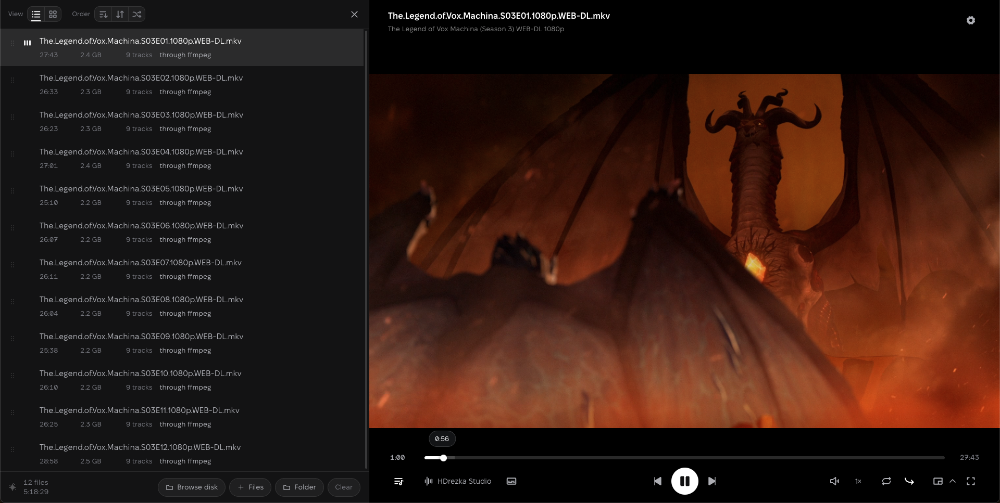
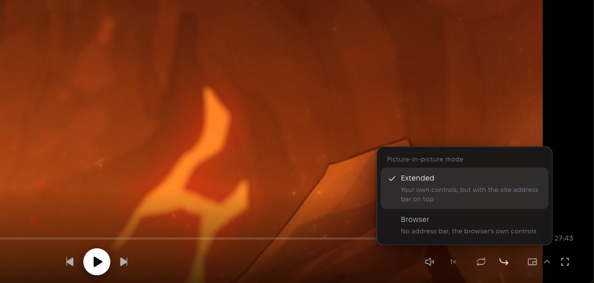
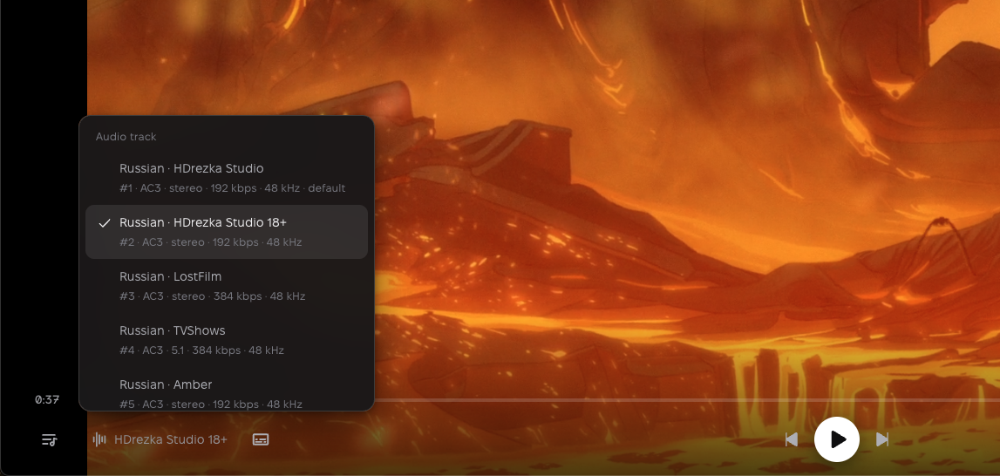
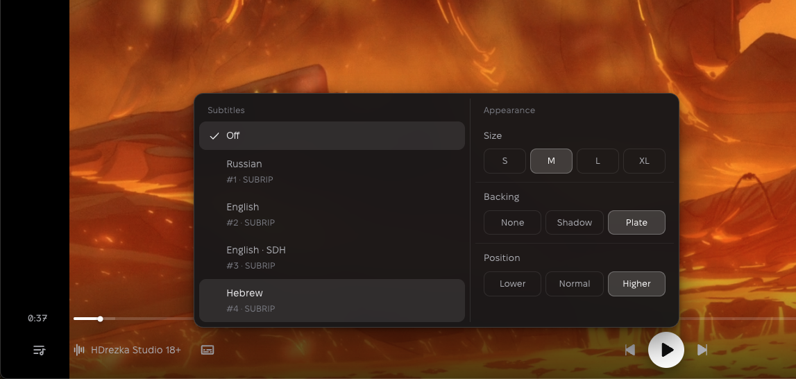
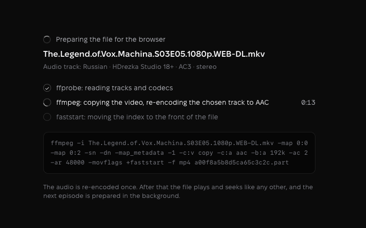
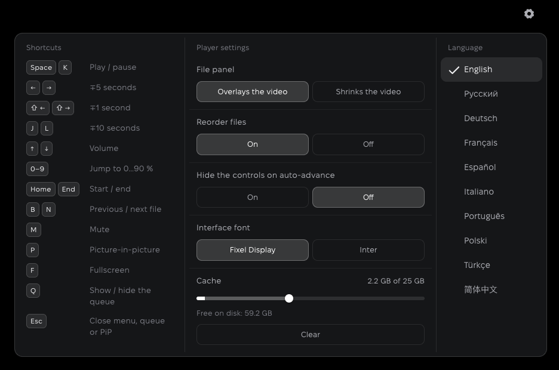
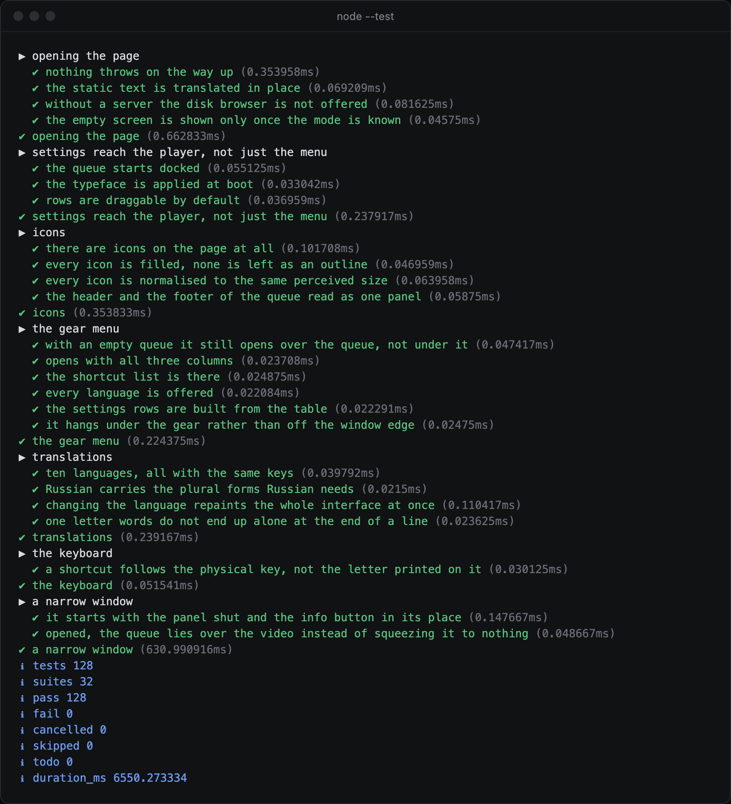

# Local PIP Player <a href="https://mythhand.space/#gh-light-mode-only"></a><a href="https://mythhand.space/#gh-dark-mode-only"></a>

[](https://nodejs.org/)
[](https://www.anthropic.com/claude/opus)

Локальный браузерный плеер для просмотра в «картинке в картинке».

Плеер нужен, чтобы смотреть сериал в «картинке в картинке» браузера: окно без
рамок и лишних оболочек, закреплённое на экране. Серии идут одна за другой,
выбранные озвучка и субтитры переходят на следующие, переключать серии можно
прямо из этого окна.

Медиатеки и аккаунтов нет. Это локальный инструмент: MKV, AVI и прочее
обрабатывает сервер на вашей машине, в сеть ничего не уходит.

Код написан с помощью Claude Opus 5 в Claude Code. Идея, дизайн и проверка
в работе: Dimbo.

English version: [README.md](README.md)



> Звук в MKV обычно AC-3 или DTS, браузер их не декодирует: картинка идёт,
> звука нет. Выбор другой дорожки тоже не помогает, в Chrome нет способа
> переключать дорожки локального файла. Локальный сервер на вашем ffmpeg
> перекодирует только выбранную дорожку, а видео отдаёт без пережатия.

## Запуск

Проверено в Chrome. Расширенный режим картинки в картинке построен на Document
Picture-in-Picture API, в Chrome он есть с версии 116.

Без локального сервера: открыть `index.html` и перетащить в окно файлы или
папку. Играет то, что браузер умеет сам.

С локальным сервером:

```bash
node server.mjs      # или npm start
```

Затем открыть `http://127.0.0.1:8777`. Нужны Node 18+ и `ffmpeg` с `ffprobe`
в `PATH`. macOS, Windows, Linux. `start.command` и `start.bat` запускают
сервер и открывают страницу по двойному клику, `start.sh` делает то же из
терминала.

| | без локального сервера | с локальным сервером |
|---|---|---|
| MP4, MOV, WebM | играет | играет, файл отдаётся как есть |
| MKV | картинка; звук, если дорожка AAC, MP3, Opus, Vorbis или FLAC | видео копируется, звук перекодируется в AAC |
| HEVC | зависит от компьютера | перекодируется в H.264 |
| TS, FLV, MPG, WMV, AVI | не открывается | перепаковывается или перекодируется |

Только с локальным сервером: выбор звуковой дорожки, субтитры, обзор диска,
возврат очереди после перезагрузки, кэш.

## Картинка в картинке

- Браузерный режим: окно без полосы с адресом, контролы браузера. Предыдущая
  и следующая серии работают через Media Session API.
- Расширенный режим: в плавающее окно уходит видео с полосой перемотки,
  переключением серий, громкостью, выбором звуковой дорожки и субтитров.
  Основное окно остаётся рабочим целиком: скорость, повтор, автопереход,
  очередь, настройки и полный экран остаются там. Изменения в одном окне сразу
  видны в другом.
  - Горячие клавиши работают и в плавающем окне.
- В обоих режимах на месте видео в основном окне заглушка с кнопкой «Вернуть
  сюда». Если очередь была закрыта, на время картинки в картинке она
  открывается в основном окне, чтобы оттуда переключать серии, а после
  закрытия плавающего окна закрывается снова.

> Убрать полосу с адресом сайта сверху окна в расширенном режиме не вышло: её
> рисует сам Chrome. Поэтому по умолчанию стоит браузерный режим.



## Звук и субтитры

- В списке дорожек: язык, название студии, кодек, раскладка каналов, битрейт,
  частота дискретизации.
- Выбор дорожки сохраняется при переключении файлов. Сначала ищется тот же
  набор дорожек, затем совпадение языка и студии, затем только языка.
- Текстовые субтитры (SRT, ASS, SSA, WebVTT, mov_text) конвертируются в WebVTT
  и подключаются к видео. Браузер понимает только WebVTT, а субтитры внутри
  MKV не читает вовсе, поэтому их извлекает сервер.
- Субтитры-картинки (PGS с Blu-ray, VOBSUB с DVD) видны в списке, но выбрать
  их нельзя. В них каждая реплика хранится изображением, в текст она не
  превращается, а вжечь её в кадр значит перекодировать всё видео.
- Выбор субтитров сохраняется так же. Размер, подложка и высота настраиваются.
- Выбор дорожки и субтитры работают только с локальным сервером.





## Локальный сервер на ffmpeg

- Один проход ffmpeg на файл и дорожку: видео копируется потоком,
  перекодируется только выбранная звуковая дорожка, в AAC. Звук сводится
  в стерео: 5.1 не сохраняется, проверить его было не на чем.
- Файл готовится целиком заранее, а не кусками на лету. При перекодировании
  кусками на каждой перемотке звук заново стыковался с видео и расходился
  с ним.
- Результат раздаётся с поддержкой HTTP Range. Перемотку делает браузер, как
  в обычном файле.
- Следующий файл готовится в фоне, с сохранением выбора аудиодорожки.
- Видео перекодируется, только если браузер не декодирует его кодек, то есть
  если это не H.264, VP8, VP9 или AV1. Пережатие процессором занимает все ядра
  на минуты, поэтому берётся аппаратный кодировщик: videotoolbox на macOS,
  NVENC, Quick Sync или AMF на Windows, NVENC или Quick Sync на Linux. При
  ошибке проход повторяется на libx264.
- Файлы, которые браузер декодирует сам, отдаются без обработки. Готовые лежат
  в кэше и вытесняются по времени последнего обращения. Файлы, которые
  читались в последние 10 минут, не вытесняются: это серия, которая играет,
  и только что подготовленная следующая. Кэш может из-за них ненадолго выйти
  за предел. Серию, стоящую на паузе дольше 10 минут, вытеснить могут, если за
  это время готовились другие файлы.
- Браузер не отдаёт путь перетащенного файла, поэтому сервер ищет его на диске
  по имени и размеру и берёт остальные из той же папки. Папки, где файлы уже
  находились, проверяются первыми.



## Воспроизведение и очередь

- Добавление: файлы, папка, перетаскивание, обзор диска. Выбранная или
  перетащенная папка читается вместе с вложенными, из обзора диска добавляются
  файлы только открытой папки.
- В обзоре диска слева быстрые ссылки: «Домашняя папка», «Загрузки», «Видео»,
  «Рабочий стол» и подключённые диски. Папка, переданная серверу аргументом,
  стоит первой.
- Сортировка по имени, обратный порядок, перемешивание, ручное изменение
  порядка файлов.
- Два вида списка: строки и сетка. В строке кадр из файла в пропорциях видео,
  название, длительность, размер и число дорожек. В сетке только кадры.
- Кнопка с прицелом в шапке очереди прокручивает список к текущему файлу.
  Когда начинается другой файл, список сам прокручивается к нему, это
  выключается в настройках.
- Автопереход к следующему файлу. Повтор очереди или одного файла. В конце
  карточка с итогом.
- Скорость от 0.5× до 2×. Перемотка мышью и клавишами, подсказка времени над
  полосой, отметка буферизации.
- Место просмотра запоминается для каждого файла. На первых 30 секундах
  возвращаться некуда, а последняя минута считается досмотренной серией,
  поэтому там возврата нет. В очереди это место отмечено тонкой линией внизу
  кадра файла.
- Громкость запоминается.
- С локальным сервером после перезагрузки страницы возвращается очередь
  и отмечается файл, на котором остановились. Играть он начинает по нажатию
  play, иначе одно открытие вкладки запускало бы ffmpeg. Без сервера очередь
  не возвращается: у перетащенного файла нет пути на диске, открыть его заново
  нечем.

## Интерфейс

- Десять языков, определяется по языку браузера.
- Два шрифта на выбор.
- Горячие клавиши привязаны к физическим кодам клавиш и работают в любой
  раскладке.
- Панель управления скрывается автоматически, состояние показывает фавиконка.
- Когда места мало, например рядом с открытой очередью, панель управления
  уплотняется: скорость, повтор и автопереход сворачиваются в шестерёнку внизу
  справа и открываются при наведении, название студии на кнопке звуковой
  дорожки укорачивается. Если букв остаётся меньше четырёх, на кнопке видна
  только иконка.
- Длинные название файла и путь обрезаются справа, целиком они видны
  в подсказке при наведении.
- Пока очередь пуста, в ней описание проекта, а в шапке вместо кнопок вида
  и порядка заголовок «О проекте». Если очередь закрыта, её открывает кнопка
  «О проекте» слева вверху. В окне уже 820 пикселей плеер запускается
  с закрытой очередью.
- Общие настройки плеера под шестерёнкой справа вверху: панель файлов
  перекрывает видео или сужает его (в окне уже 820 пикселей она всегда поверх
  видео), ручное изменение порядка файлов, прокрутка очереди к текущему файлу,
  скрытие панели управления при автопереходе, шрифт, язык. Там же список
  горячих клавиш и кэш сервера.
- Кэш показан одной полосой: заливка показывает занятое место, ручка задаёт
  предел, по умолчанию 24 ГБ. Полоса заканчивается там, где кончается место
  для кэша на диске: занятое им плюс свободное. Меньше 4 ГБ предел не
  ставится. Если сохранённый предел перестал помещаться на диске, ручка
  становится кольцом, а под полосой появляется предупреждение. Размер диска
  сервер узнаёт в Node 18.15 и новее, в более старом шкала строится от предела
  и занятого места. Кнопка очистки удаляет всё, кроме файла, который играет,
  иначе первая же перемотка ушла бы в пустоту.



## Горячие клавиши

| | |
|---|---|
| `Space` `K` | пауза |
| `←` `→` | ∓5 секунд |
| `Shift` + `←` `→` | ∓1 секунда |
| `J` `L` | ∓10 секунд |
| `↑` `↓` | громкость |
| `0` … `9` | переход на 0 … 90 % |
| `Home` `End` | начало / конец |
| `B` `N` | предыдущий / следующий файл |
| `M` | без звука |
| `P` | картинка в картинке |
| `F` | полный экран |
| `Q` | показать / скрыть очередь |
| `Esc` | закрыть меню, окно расширенного PiP или очередь |

Полоса перемотки в фокусе через `Tab`: `←` `→` на 5 секунд, `PageUp`
`PageDown` на минуту. Клик по картинке: пауза. Двойной клик: полный экран.

## Параметры сервера

```bash
PORT=9000 node server.mjs                # порт, по умолчанию 8777
PIP_CACHE=/путь/к/папке node server.mjs  # папка кэша, по умолчанию во временной папке системы
PIP_CACHE_GB=40 node server.mjs          # начальный предел кэша в ГБ, по умолчанию 24
PIP_ENCODER=software node server.mjs     # без аппаратного кодирования
node server.mjs /Volumes/Media           # ещё одна папка, доступная серверу
```

Предел, выставленный в плеере, сохраняется в папке кэша и после перезапуска
важнее `PIP_CACHE_GB`. Путь к кэшу печатается при запуске.

## Что читает сервер

Сервер показывает содержимое папок и отдаёт файлы, для этого он и нужен.
Поэтому доступ к нему ограничен:

- Слушает только `127.0.0.1`, с других машин он недоступен.
- Отклоняет запросы с чужим `Host` и запросы, сделанные другими сайтами. Без
  этого любая страница, открытая в том же браузере, могла бы через работающий
  сервер читать ваши папки и файлы.
- Читает домашнюю папку, `/Volumes`, `/media`, `/mnt`, `/run/media`, диски на
  Windows и папку, переданную аргументом. Остальные пути отклоняет.
- Открывает только медиафайлы, видео и звук. Остальные файлы в этих папках не
  отдаёт.
- Пишет только в свой кэш.

## Файлы проекта

```
index.html      разметка
styles.css      стили
app.js          плеер
i18n.js         тексты интерфейса на десяти языках
server.mjs      локальный сервер на ffmpeg
check.mjs       проверка разметки, стилей и переводов
test/           тесты
package.json    команды npm: start, check, test
.gitattributes  переносы строк для файлов запуска
.github/        форма сообщения об ошибке и автотесты на GitHub
assets/         картинки для README, логотип, знак и аватар
assets/fonts/   шрифты и их лицензии
start.command   запуск, macOS
start.bat       запуск, Windows
start.sh        запуск, Linux
README.md       описание на английском
README.ru.md    описание на русском
LICENSE         лицензия MIT
```

## Проверка

```bash
node check.mjs       # или npm run check
node --test          # или npm test
```

`check.mjs` проверяет разметку, стили и словари без запуска. `node --test`
запускает тесты: сервер по HTTP, интерфейс в Chrome без окна. Медиа для тестов
собирает ffmpeg во временной папке, ваши файлы не читаются. Нужны Node 20+,
ffmpeg и Chrome; без Chrome тесты интерфейса пропускаются. Путь к Chrome можно
задать переменной `CHROME`.



## Шрифты и иконки

| | |
|---|---|
| [Fixel Display](https://fixel.macpaw.com/) | SIL Open Font License 1.1, © 2023 MacPaw Inc. (Authors: Alfabravo + MacPaw) |
| [Inter](https://rsms.me/inter/) | SIL Open Font License 1.1, © 2020 The Inter Project Authors |
| [Phosphor Icons](https://phosphoricons.com/) | MIT |

## Автор

[mythhand.space](https://mythhand.space/)

## Лицензия

MIT, см. [LICENSE](LICENSE). У шрифтов свои лицензии, они указаны выше.
Название MythHand, логотип, знак и аватар под MIT не попадают: права на них
сохраняются за MythHand.
